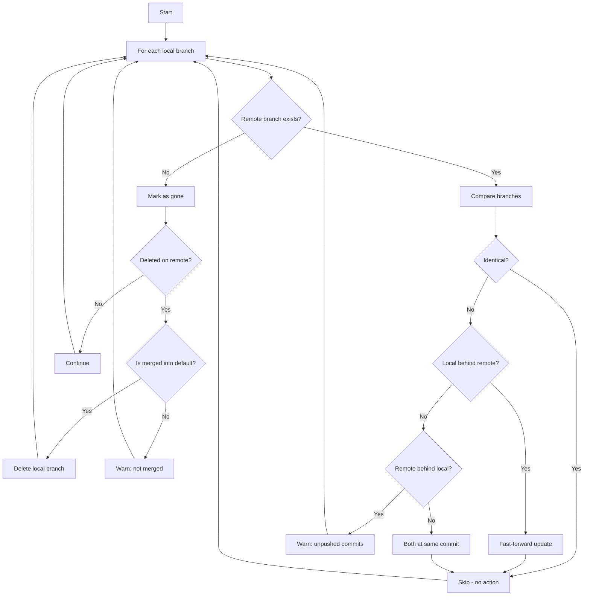

# Git Sync

Git subcommand to synchronize local branches with remote repository. Fast-forward updates local branches behind remote. Deletes local branches when remote branch deleted and merged into default.

> [!NOTE]
> This project was created as a vibe-coding experiment to rewrite in Rust the very helpful sync command from [hub](https://github.com/mislav/hub/blob/master/commands/sync.go). Many thanks to the original authors for the time I've saved using their tool over the years.
>
> Initial code was developed using [GitHub Copilot](https://copilot.github.com/) and Anthropic's [Claude](https://www.anthropic.com/). 
> I've then switched to [Pi](https://pi.dev/) and [Mistral](https://mistral.ai/) models.

> [!WARNING]
> This tool is mainly for personal use (but any improvement/fix requests are welcome). 
>
> While only operating locally, remember it performs destructive operations (branch deletion) and assumes you understand git workflows. Use with caution.

## Features

- Automatic detection of main remote (priority: upstream, origin)
- Dry run mode to preview changes
- Progress tracking
- Continue on error option
- Verbose output for debugging
- Colorized output

## Installation

### Prebuilt Binaries

Prebuilt binaries are available for Linux and macOS. Download the latest release from [GitHub Releases](https://github.com/aolwas/gitsync/releases).

If you are using [mise](https://mise.jdx.dev/), you can install the prebuilt binary with:

```bash
mise install github:aolwas/gitsync
```

### Build from Source

Clone the repository and build with Cargo:

```bash
cargo install --path .
```

Make sure the [cargo bin path](https://doc.rust-lang.org/cargo/commands/cargo-install.html) is in your PATH.

## Usage

```bash
git sync [OPTIONS]
```

## Options
- `-v, --verbose` - Verbose output
- `--color <CHOICE>` - Colorize output (always, never, auto)
- `--dry-run` - Show what would be done without making changes
- `--continue-on-error` - Process all branches even if some fail
- `-r, --remote <NAME>` - Remote to sync with (overrides auto-detection)

## Algorithm



### Branch Synchronization Process

For each local branch:

1. **Find remote counterpart**
   - Check upstream configuration first
   - Fall back to same-name branch on main remote
   - Mark as gone if remote branch no longer exists

2. **Compare with remote**
   - If identical: skip (no action needed)
   - If local is ancestor of remote: local is behind, fast-forward possible
   - If remote is ancestor of local: local has unpushed commits, warn only
   - If both ancestors: branches at same commit, skip

3. **Fast-forward update** (when local behind)
   - Current branch: `git merge --ff-only --quiet <remote_branch>`
   - Other branches: `git update-ref <local_ref> <remote_ref>`
   - Preserves local commit history, only moves branch pointer forward

4. **Handle deleted remote branches**
   - Check if local branch fully merged into default branch via `git rev-list <default>..<branch>`
   - If merged: delete local branch with `git branch -D`
   - If current branch being deleted: checkout default branch first
   - If not merged: warn, keep local branch

### Key Git Operations

- `git merge-base --is-ancestor`: Determine if one commit is ancestor of another
- `git rev-list A..B`: Find commits in B not in A (empty means B merged into A)
- `git rev-parse`: Get commit SHAs for comparison
- `git update-ref`: Directly update branch reference (faster than checkout)

### Safety Checks

- Never force delete unmerged branches
- Never overwrite unpushed local commits
- Always verify merge status before deletion
- Checkout safe branch before deleting current branch
